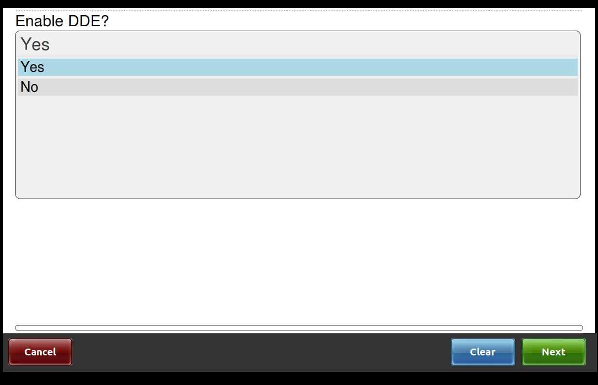
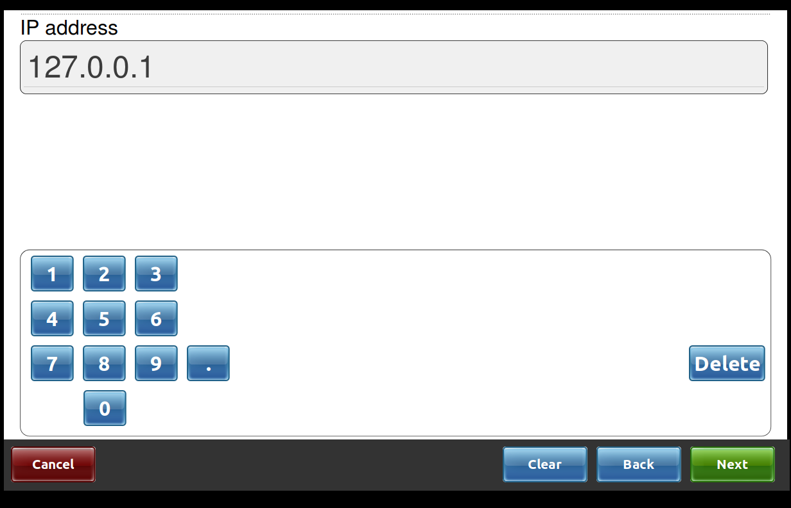
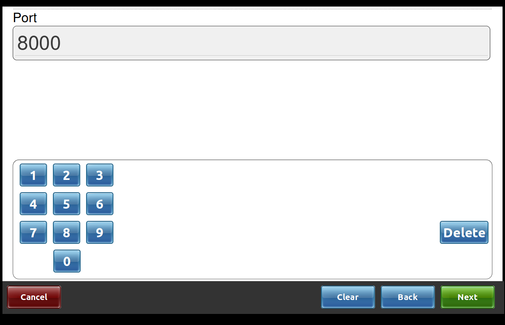
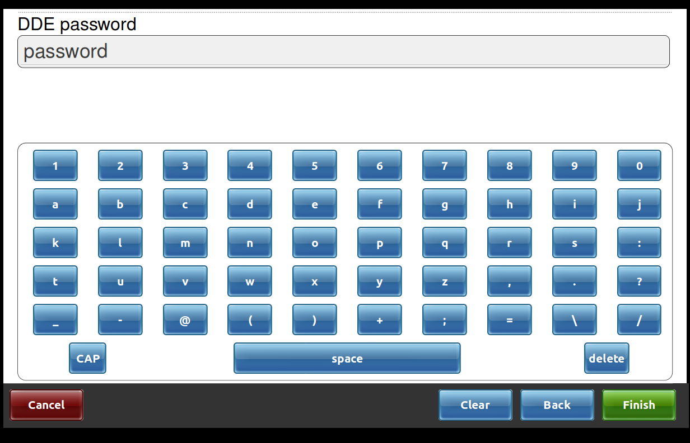
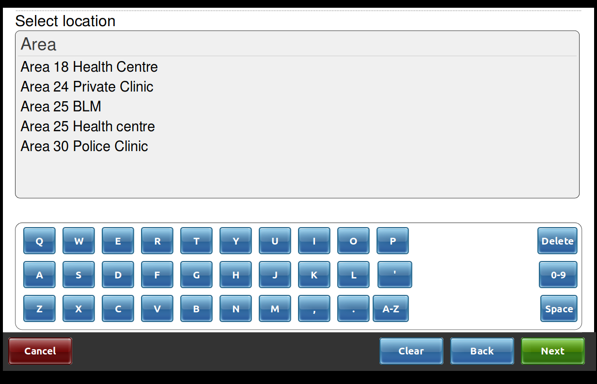
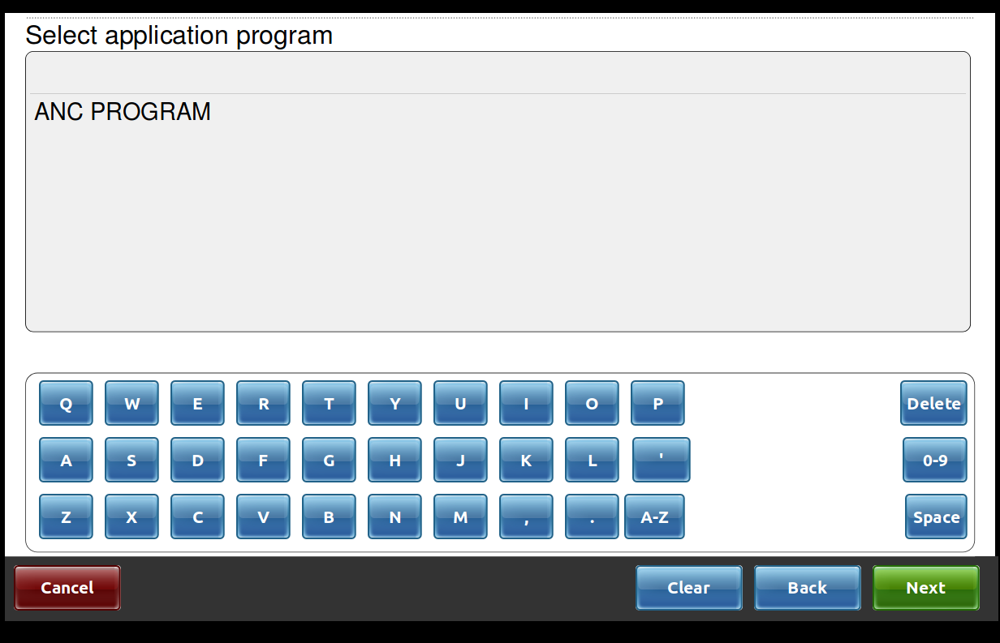
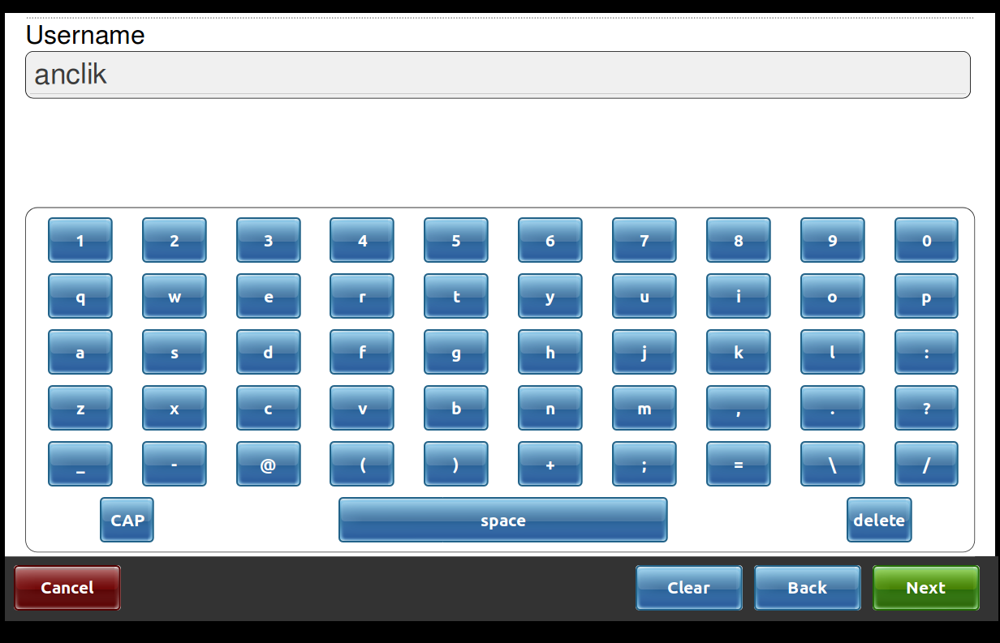

# EMR Antenatal Clinic 

## Build
___

### Prerequisites

#### Ruby
ANC run on ruby on rails which is why you need to install ruby. 
Ruby version 2.5.3 with Rubygem 2.7.6 is a requirement.

#### Mysql
Mysql is used as a database for the application. 
You need to ensure that mysql 5.0.0 or higher is installed
before starting to configure ANC.

#### Git
Install the version control tool [git](https//git-scm.com) and clone this repository
```
  $ git clone https://github.com/BaobabHealthTrust/ANC-3.git
```

### Set up
___
After you have taken care of the [Prerequisites](https://github.com/BaobabHealthTrust/ANC-3#prerequisites)
its time to set up the application on your machine.

#### Let's put things together
In the config folder, copy all .yml.example files into .yml files. 
To achieve this perform the following commands
```
  $ cp config/database.yml.example config/database.yml
  $ cp config/application.yml.example config/application.yml
  $ cp config/dde_connection.yml.example config/dde_connection.yml
```

Run the following command to install rubygems that are necessary in running your application.
```
  bundle install
```
You can run the following if you are not connected to internet.
```
  bundle install --local
```

#### Database configuration

In the database.yml file, provide your database credentials and database name to be used by the application.
If you running in the development, provide database name under development and production otherwise.

ANC depends on National ART to track and manage ART patients in this application. Therefore in your bart2 block 
in the database.yml file, provide database for National ART at the site. If National ART database is on a different server
replace:
```
bart2:
  <<: *default
  database: openmrs
```
with
```
bart2
  adapter: mysql2
  encoding: utf8
  pool: <%= ENV.fetch("RAILS_MAX_THREADS") { 5 } %>
  username: root
  password: password
  socket: /var/run/mysqld/mysqld.sock
  host: 127.0.0.1
  database: openmrs
```
replacing username, password and host values with appropriate values that suits you.

#### Properties configuration

To configure properties, go to config/application.yml file. Some of the configurations includes among other
* Integration with National ART. Provide the following values appropriate to you.
```
  create_from_remote: yes
  ...
  create.from.remote: true
  ...
  art_link: 127.0.0.1:3000
  remote_servers.parent: 127.0.0.1:3000
  remote_bart.username: art_user
  remote_bart.password: password
  remote_bart.location: 721
  ...
```
* Capturing of father details. If you would like to get father details set **father_details** to **true**:
```
  ...
  father_details: true
  ..
```
* Recency test capturing. Set **rececy_test** to **true**
```
  ...
  recency_test: true
  ...
```
* District. This specified the district of the site the application is running.
```
  ...
  district: Lilongwe
  ...
```

Remember that the above configurations applies to the environment you are running, i.e development, production.

#### Database initialization

After configuring database, run the following script in your terminal to initiate database in mysql
```
  $ ./bin/initial_database_setup.sh <ENV> <SITE_CODE>
```
replacing <_ENV_> with the environment you are running and <_SITE_CODE_> with the site code of the site.

Then load an openmrs_metadata from db/ folder. The command below should help you;
```
  $ mysql -u root -p openmrs_development_anc < db/openmrs_metadata_1_7.sql
```
replacing openmrs_development_anc with the name of your database.

Finally run the database migration 
```
  rails db:migrate
```

## DDE Integration
___
DDE is short for Demographics Data Exchange. An API for exchanging patient's 
demographics data between EMR applications using a patient ID. For more 
information go to [DDE Repository](https://github.com/BaobabHealthTrust/Demographics-Data-Exchange)
(for users who have the access only).

Once DDE is up and running, you can now set ANC to communicate with it. Here is how you can configure DDE on ANC.

* Ensure that you have copied dde_connection.yml.example file in config folder from the set up above. 
* Ensure database migration has been done.
* Ensure openmrs_metadata has been loaded to your mysql database.

### Activate DDE in ANC

On the dashboard, go to Administration tab, click on Configurations and then Enable/Disable DDE. The follow the following steps:

1. Select yes to enable dde. If you are already activated this is where you turn DDE off by selecting no, the system will take you back to dashboard.



2. Provide DDE host address.



3. Enter DDE port.



4. Enter DDE default admin username as provided in DDE documentation.


5. Enter DDE admin password. If DDE user was already created and is still active, you'll be taken back to dashboard and dde would be activated.



6. After providing password, if you're a first time user, the application will provide a list of site to choose from. Carefully choose the site in which this application is configured. If the site names doesn't match, the application will refuse to create dde user for the application, hence dde will not be activated.



7. You will then be presented with a list of application programs, normally for ANC you'll be presented with ANC PROGRAM, select and proceed.



8. Provide the username for the application to dde. It is recommended that the username should be the combination of application and site code, i.e, ancSITE_CODE replacing SITE_CODE with the site code in small cases.



9. Then provide the password for the user.

